<h2 align="left"></h2>

# Like a Local - Travel Guides

## Code Institute Milestone Project 2 – Interactive Front End Project

<h2 align="left">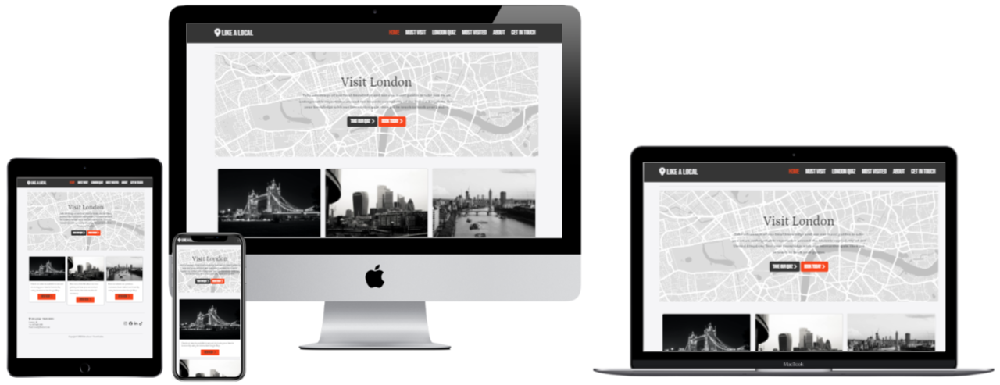</h2>

*  Like a Local is a travel guide website that specialises in visits to the UK capital city of London. The objective of the website is to provide information to potential visitors to London with a view to them purchasing a travel guide pack from the website. The website is designed to be fully responsive so that the users experience is consistent across any device.   

* This website has been developed for the Milestone Project 2 submission as part of the Diploma in Web Application Development course facilitated by Code Institute and City of Bristol College.  

* This interactive front end website has been built using the different programming languages learned during the course, including HTML, CSS and JavaScript. The website has also utilised the Bootstrap, jQuery framework libraries and Application Programming Interfaces such as Google Maps and EmailJS.  

## Live Project  

[You can view the live project here.](https://patiat.github.io/like-a-local/)

## GitHub Repository  

[You can find the project repository here.](https://github.com/PATIAT/like-a-local)

# Contents  

- [User Experience](#user-experience)  

  * [User Stories](#user-stories)  

    + [Prospective tenants](#prospective-tenants)  

    + [Returning tenants](#returning-tenants)  

    + [Business owners](#business-owners)  

- [Design](#design)  

  + [Colour scheme](#colour-scheme)  

  + [Typography](#typography)  

  + [Imagery](#imagery)  

  + [Icons](#icons)  

- [Structure](#structure)  

  + [Website Architecture](#website-architecture)  

  + [Navigation Bar](#navigation-bar)  

  + [Back To Top Button](#back-to-top-button)  

  + [Buttons](#buttons)  

  + [Page Heading & Sub Navigations](#page-heading-and-sub-navigations)  

  + [Footer](#footer)  

- [Wireframes](#wireframes)

- [Features](#features)

  + [Current Features](#current-features)

  + [Future Features](#future-features)

- [Technologies Used](#technologies-used)

  + [Languages Used](#languages-used)

  + [Frameworks Libraries and Programs](#frameworks-libraries-and-programs)

- [Testing](#testing)

- [Deployment](#deployment)

- [Credits](#credits)

  + [Code](#code)

  + [Content](#content)

  + [Acknowledgements](#acknowledgements)

# User Experience  

## User Stories  

### New visitors to London

*The website users that fall into this category are considering visiting the London for the first time and are in need of some advice on where to visit.*  

* As a new visitor to the website and tourist to London, I would like to learn some basic information about London.

* As a new visitor to the website and tourist to London, I would like to test my existing knowledge on all things London by taking a fun and interactive quiz game with London themed questions.

* As a new visitor to the website and tourist to London, I would like to be able to search for things to do using a map of the area of London.

* As a new visitor to the website and tourist to London, I would like to learn where previous customers have visited to decide if I would like to follow suit.

* As a new visitor to the website and tourist to London, I would like to be able to contact the travel guides if I have any questions or special requests.

### Returning Visitors  

*The website users that fall into this category are considering returning to London, having already previously visisted.*  

* As a returning visitor to the website and tourist to London, I would like to know if any new features have been added to the website or if any are planned.

* As a returning visitor to the website and tourist to London, I would like to know if the frequently visited page has been updated to include recent users.

* As a returning visitor to the website and tourist to London, I would like to be able to let the website owners know that I am a returning customer when contacting them.

### Business Owners  

*The business owners are the owners of the website and travel guide business*  

* As the business owner, I would like my website to be user friendly across all devices and accessible to visually impaired users.  

* As the business owner, I would like the website to effectively promote London as a tourism destination and what the business can offer to facilitate better visits for tourists.

* As the business owner, I would like the website to emphasise the openness of us as owners and promote the asking of questions from users via the contact form and social media platforms.  

## Design  

### Colour Scheme  

#### Primary Colours
<h2 align="left">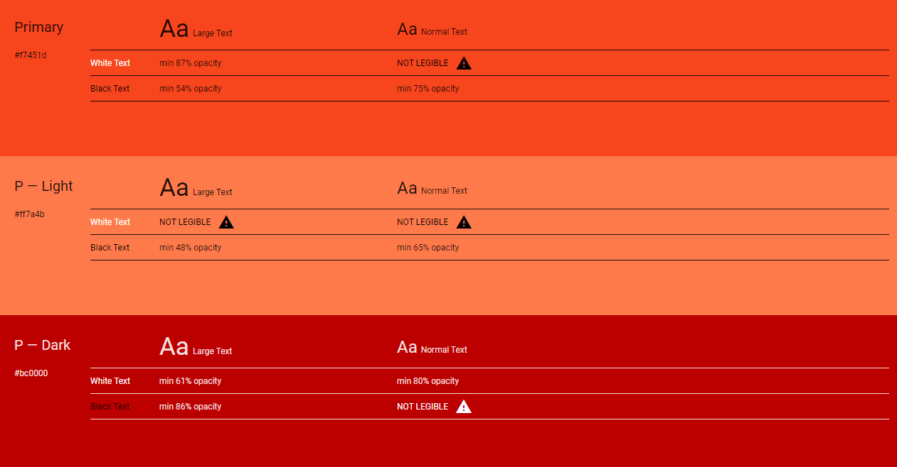</h2>  

#### Secondary Colours
<h2 align="left">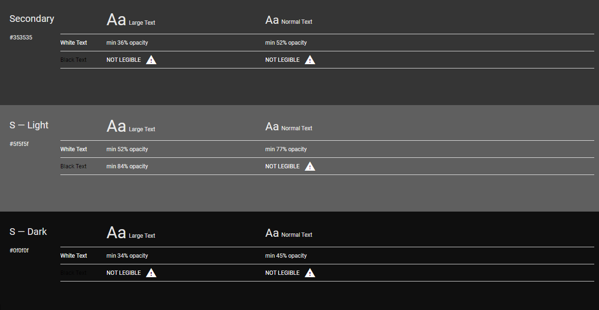</h2>  

- A simple colour scheme has been used with three primary colours and three secondary colours. The colours are all relatively vibrant and bright with dark type being used in contrast to give a refined and clean appearance.  

- This colour pallette has been chosen primarily on personal preference but additionally because the colours work well together and compliment each other.

- I used the [Material Design Colour Tool](https://material.io/resources/color/#!/?view.left=0&view.right=0) to decide on colour choices.  

### Typography  

- Headings are in Bebas Neue and normal text is in Petrona. Bebas Neue is a cursive font which is eyecathing and sophisticated which is in keeping colour scheme chosen. Therefore cursive is the fallback font should Bebas Neue be unavailable. Petrona is a clean and legible font which is a popular used for websites all over the world, particularly in the United States. Serif is the fallback font should Petrona be unavailable.  

### Imagery  

- The images have been sourced from free image websites and attributed to the photographer where necessary. The images were chosen to compliment the colour scheme and to ensure consistency throughout the website.

- Where practical, I have used landscape images and the aspect ratio has been maintained. 

- An image of a map of London is used on the home page but is also used as a background on the quiz page. 

- Both ARIA roles and attributes as will as alt tags have been used to assist users with disabilities.

### Icons  

- All icons were sourced from Font Awesome and have been used sparingly across each page to allow for a more focused approach to catch the users attention.  

- Screen reader utilities such as sr-only have been utilised to assist users with disabilities.

## Structure  

### Website Architecture  

- This website has a home page and a further 5 pages, namely; Must Visit, London Quiz, Frequently Visited, About and Contact.  

  - Home page – This is the landing page with a hero image and descriptions and navigation to the other pages.  

  - Must Visit: This page utilises the Google Maps API with neighbourhood discovery information to show local attractions. 

  - London Quiz: This page contains an interactive quiz which consists of a bank of 10 randomly generated questions (from a total of 40) which are all related to London in some wat. The aim of this page is to allow users to test their knowledge of London either before visiting for the first time of prior to a return visit. Or just for fun. 

  - Most Visited: This page utilises the Google Maps API clustering function to demonstrate where previous users of the travel guide service have visited during their visits to London.

  - About: This is a simple page which informs the users about the travel guide business and travel guides themselves.

  - Contact: This page utilises the Email JS API/SDK to allow users to send an email request from the form on the website to the business owners.

  - Each page features a main ‘call to action’ which is achieved through a combination of images and buttons. The aim was to allow users to get to the information the page has to offer in as few steps as possible. 

  - The website utilises continuous scrolling pages and collapsible menus to display the majority of its information.

  - Visually impaired users and those with disabilities have been considered and a semantic layout has been utilised in combination with aria roles and attributes. 

### Headings and sub headings 

  - Each page of the website contains a heading to consistently show the user what to expect on each page. 
 
  - All of the pages except from the home page have heading section to clearly define what is to be expected from the page contents below it. 

<h2 align="left">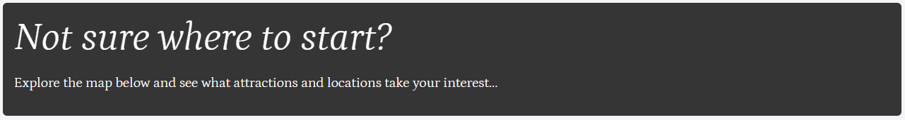</h2> 

### Navigation Bar 

  - Each of the pages maintains the same navigation section which allows all users to easily navigate between the pages without having to use the browser or return to the homepage.  

  - The website utilises a collapsible navigation bar which shrinks as the screen size decreases until a hamburger icon is used to open and close the navigation menu.

  - The navigation bar was sourced from bootstrap documentation and has been customised using CSS to create a unique background, font and colour combination.

  - The active page is shown in a different colour to the rest of the navigation links. Aria controls are in place to assist visually impaired users. This along with the hover changes were implemented with the use of CSS and bootstrap. 

<h2 align="left">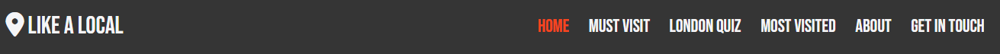</h2> 
<h2 align="left">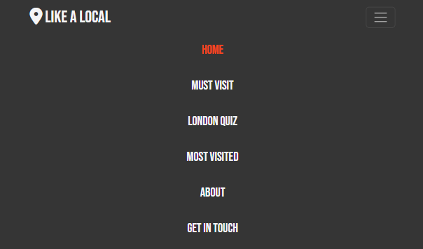</h2> 
<h2 align="left">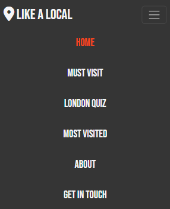</h2> 

### Buttons 

  - The buttons used across the pages are consistent throughout using the colour palletes of the primary and secondary colours as details above.  

  - The text on each of the buttons is followed by a chevron icon sourced from fontawesome to guide the user to follow the link. 

  - The buttons use a hover class so when the user hovers over it, it changes colour. Both colour variants were assessed and determined to be legible. 

  - Bootstrap buttons were used and customised with CSS.

<h2 align="left">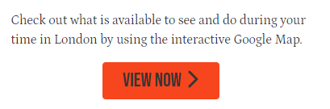</h2> 
<h2 align="left">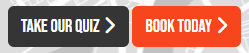</h2> 
<h2 align="left">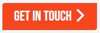</h2> 
<h2 align="left">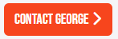</h2> 

### Footer 

  - The footer is consistent on each page and contains the logo, address, telephone, email and social media links. 

  - The telephone and email links have been added and tel and mailto links. 

  - All links to external social media sites open in a new tab. 

  - The social media icons were source from font awesome.

<h2 align="left">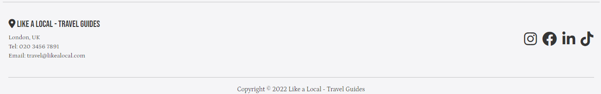</h2> 
<h2 align="left">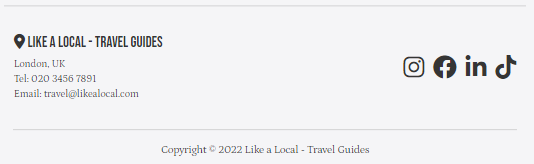</h2> 
<h2 align="left">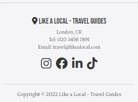</h2> 

### Wireframes 

- [You can view my wireframes here.](https://github.com/PATIAT/like-a-local/blob/main/assets/wireframes/like-a-local-wireframes.png) 

# Features 
 
## Current Features 
 
### Responsive on all device sizes 

  - The development of this website was mobile first, therefore the website is fully responsive on all device screen sizes. 

  - I have used the Bootstrap grid concept and adjusted the layout according to the size of the devices screen size. In some cases this was facilitated by the use of CSS media queries.

### User interaction 

  - Google Places API Neighborhood (Must Visit Page) - This allows the user to interact with the Google Maps and Google Places API's and find areas of interest in and around London.

  - The London Quiz Page - This allows users to complete an interactive quiz: 
  
     - The quiz shows a:

        - A current score (out of 10) which is updated for each turn.
        - A current question (out of 10) which is updated for each turn.
        - A current question.
        - Four potential answers.
        - A "Next Question >" button.

     - The user must select one of the four potential answers, if they do not a function is called to display a modal which is desinged to prompt that action.
     - When the user selects their answer, the answer is differentiated from the others by changing colour. 
     - When the user selects their answer and clicks "Next Button >", their selection will either turn green (for correct answers) or red (for incorrect answers). In the event that the user selects the incorrect answer, the correct answer will also be highlighted in green to show them which answer was correct.
     - Upon completion of the last question, another function will be called which prompts the display of another modal, this time displaying the users score and grade. A different message will be displayed based on the overall grade.
     - Once the round is complete, the user can then click the "Play Again" button to start a new round.

  - Google Maps API Clustering (Most Visited Page) - This allowes the user to interact with the Google Maps to see where the most visited places are. These places are represented by markers on the map which cluster together depending on the level of zoom the user selects. 

  - Email JS (Get In Touch Page) - This page allows the user to complete a simple form and upon clicking the "Get In Touch" an email is sent which is facilitated by Email JS. The code will present the user with a modal to tell them if the message has been successful or not.

  - The navbar turns into a drop down (hamburger on smaller devices). 

## Future Features 

### Bookings 

  - A booking form which allows users to choose dates for a potential stay could be developed and included. 

### E-commerce 

  - The website could offer merchandise related to the the Travel Guide Business, London or local area attractions for people to buy as souvenirs or gifts. 

### Reviews

  - Genuine reviews could be displayed on the website or via a third party widget such as Trust Pilot.

### Updates

  - The most-visited page could be updated based on recent clients favourite and most loved destinations during their visit. This could be displayed as a "last updated: 17/01/2023" tage on the page following an update to co-ordinates in the code itself.

# Technologies Used 
 
## Languages Used 
 
- [HTML5](https://en.wikipedia.org/wiki/HTML5) 
 
- [CSS3](https://en.wikipedia.org/wiki/CSS) 

- [JavaScript](https://en.wikipedia.org/wiki/JavaScript) 

## Frameworks Libraries and Programs 
 
- [Bootstrap 5.3](https://getbootstrap.com/)  
  - I used bootstrap throughout the site to make it responsive. The website uses Bootstrap's Containers, Grid System and Flexbox and Button classes. I sourced code from the Bootstrap documentation when building the Navbar, Carousel, Buttons and Contact Form,  
   
- [Google Fonts](https://fonts.google.com/) 
  - Two fonts were imported from google fonts. Aboreto for the headings, and Lato for the general text. 
   
- [Font awesome](https://fontawesome.com/) 
  - Icons were used from font awesome to add texture to some of the pages and styles.
 
- [Gitpod](https://gitpod.io/) 
  - Gitpod was used to create the folder structure and write the code and content. 

- [Git](https://git-scm.com/) 
  - Git was used for version control in the terminal. 
 
- [Github](https://github.com/) 
  - Github was used to create and store the project repository. 
  
- [jQuery](https://jquery.com/) 
  - jQuery is associated with the bootstrap cdn and assists in the navigation responsiveness. 
 
- [Balsamiq](https://balsamiq.com/) 
  - Balsamiq was used to create Wireframes for the project. 

- [Material Design Colour Tool](https://material.io/resources/color/#!/?view.left=0&view.right=0) 
  - The colour tool from Material Design was used to decide on the colour scheme for the website and the tools helped assess the legibility.

- [Techsini](https://techsini.com/multi-mockup/) 
  - Techsini was used to help check responsiveness and take screenshots of the page at different screen sizes.

- [IloveIMG](https://www.iloveimg.com/resize-image#resize-options,pixels)
  - I love IMG was used to re-size some of the images used.

- [Adobe Stock](https://www.adobestock.com/) 
  - Adobe stock was used to source the map image of London on the home page.

- [Pexels](https://www.pexels.com/) 
  - Pexels was used to source images for the website, including:
    - [Photo by Ivelin Donchev:](https://www.pexels.com/photo/tower-bridge-14765794/)
    - [Photo by Karam Alani:](https://www.pexels.com/photo/grayscale-photo-of-city-buildings-5012092/)
    - [Photo by Karolina Fijas:](https://www.pexels.com/photo/)birds-eye-view-of-city-skyline-in-grayscale-photo-5944410/
    - [Photo by Mike B:](https://www.pexels.com/photo/aerial-view-of-city-buildings-6100149/)
    - [Photo by Andrés García:](https://www.pexels.com/photo/aerial-view-of-city-buildings-4854415/)
    - [Photo by Kevin Bidwell:](https://www.pexels.com/photo/)bald-man-with-a-serious-facial-expression-2380794/
    - [Photo by Jan Tafel:](https://www.pexels.com/photo/monochrome-portrait-of-man-2341350/)
    - [Photo by Mwabonje:](https://www.pexels.com/photo/beautiful-woman-smiling-for-a-photo-1820559/)

- [TinyPNG](https://tinypng.com/) 
  - TinyPNG was used to compress images for a faster loading time. 
 
- [WebFormatter](https://webformatter.com/html) 
  - WebFormatter was used to help beautify the code.

- [Google Chrome Dev Tools](https://developer.chrome.com/docs/devtools/) 
  - Google Chrome's Dev Tools were utilised during the build of the project to test functionality, responsiveness and for debugging purposes.

- [Canva](https://www.canva.com/)
  - Canva was used to create the logo and the favicon used on the website and README documentation. 

## Application Programming Interface (API's)
 
- [Google Maps API](https://developers.google.com/maps/documentation/javascript)
  - This was used to create the cluster map on the most-visited.html page.
 
- [Google Placed API](https://developers.google.com/maps/documentation/places/web-service/overview)
  - This was used to create the neighbourhood search map on the must-visit.html page

- [EmailJS](https://www.emailjs.com/)
  - This was used to create the functionality of sending the data from the form on the get-in-touch.html page.

# Testing 

- For all testing documentation, please [click here](https://github.com/PATIAT/like-a-local/blob/main/TESTING.md) for more information.

# Deployment

## Creating a Gitpod Workspace

The project was created in Gitpod using the Code Institute Gitpod Full Template using these steps:

1. Log in to GitHub and go to the [Code Institute student template for Gitpod](https://github.com/Code-Institute-Org/gitpod-full-template)
2. Click 'Use this Template' next to the Green Gitpod button.
3. Add a repository name and click 'Create reposiory from template'.
4. This will create a copy of the template in your own repository. Now you can click the green 'Gitpod' button to open a workspace in Gitpod.

## GitHub Pages

The project was deployed to GitHub Pages using these steps:

1. Log in to GitHub and go to the [GitHub Repository](https://github.com/PATIAT/like-a-local)
2. Locate the Navbar at the top of the Repository (not top of page). Click the Settings tab.
3. Locate the Navbar on the left hand side of the page. Click the "Pages" section (under 'Code and automation').
4. Under "Source", click the dropdown called "None" and select "main". Click save.
5. The page will automatically refresh.
6. A notification will appear at the top of the page with the [link](https://patiat.github.io/like-a-local/index.html) to the deployed site. You can return to this GitHub Pages section to access the link.

## Forking the GitHub Repository

Forks are used to propose changes to someone else's project or to use someone else's project as a starting point for your own idea. By forking the GitHub Repository you make a copy of the original repository on our GitHub account to view and/or make changes without affecting the original repository.

To Fork a Github Repository:

1. Log in to GitHub and navigate to the [GitHub Repository](https://github.com/PATIAT/like-a-local)
2. In the top-right corner of the page, click Fork.
3. Select an owner for the forked repository.
4. By default, forks are named the same as their parent repositories. You can change the name of the fork to distinguish it further.
5. Optionally, add a description of your fork.
6. Choose whether to copy only the default branch or all branches to the new fork. For many forking scenarios, such as contributing to open-source projects, you only need to copy the default branch. By default, only the default branch is copied.
7. Click Create fork.
8. You should now have a copy of the original repository in your GitHub account.

## Making a Local Clone

You will now have a fork of the repository, but you don't have the files in that repository locally on your computer.

To make a local clone:

1. Log in to GitHub and go to the [GitHub Repository](https://github.com/PATIAT/like-a-local)
2. Above the list of files, click  Code.
3. Copy the URL for the repository.
  - To clone the repository using HTTPS, under "Clone with HTTPS", click the 'Copy' icon. 
  - To clone the repository using an SSH key, including a certificate issued by your organization's SSH certificate authority, click Use SSH, then click the 'Copy' icon. 
  - To clone a repository using GitHub CLI, click Use GitHub CLI, then click the 'Copy' icon.
4. Open Git Bash.
5. Change the current working directory to the location where you want the cloned directory.
6. Type git clone, and then paste the URL you copied earlier. It will look like this, with your GitHub username instead of YOUR-USERNAME:

```
$ git clone https://github.com/YOUR-USERNAME/YOUR-REPOSITORY
```

7. Press Enter. Your local clone will be created.

```
$ git clone https://github.com/YOUR-USERNAME/YOUR-REPOSITORY
> Cloning into `milestone-project-one`...
> remote: Counting objects: 10, done.
> remote: Compressing objects: 100% (8/8), done.
> remove: Total 10 (delta 1), reused 10 (delta 1)
> Unpacking objects: 100% (10/10), done.
```

Click [here](https://docs.github.com/en/github-ae@latest/get-started/quickstart/fork-a-repo) for the GitHub quick start guide with images and more detailed explanations of the above process.

# Credits

## Code

-   [Bootstrap 5.3](https://getbootstrap.com/): The Bootstrap library was utilised throughout the development of the project to make site responsive using the Bootstrap Grid System and Flexbox. Bootstrap documentation was referred to when developing the Navigation, Carousel, Accordian, Buttons and Contact Form. 

-   [Code Institute](https://codeinstitute.net/): I used the Code Institute's learning management system to remind myself of certain lessons and to use specific code from some of the projects done during the course. For example, the footer from the Resume project and the use of the iFrame from the Coders Coffee House Lessons.

-   [Google Maps API Documentation](https://developers.google.com/maps/documentation?_gl=1*uijbhj*_ga*OTIyNjE3NjUuMTY2MTg1NjYwOA..*_ga_NRWSTWS78N*MTY3Mzg5NTY0NS44LjEuMTY3Mzg5NTY0Ny4wLjAuMA..): I referred to this when setting up the must-visit and most-visited pages. The sample code was also used and modified using CSS for the neighborhood places API integration on the must-visit page.

## Content

-   Add links to other sites that inspired this one, if there are any.
    - [Travelocity](https://www.travelocity.com/) - I used this website for inspiration on design and layout.
    - [Visit London](https://www.visitlondon.com/things-to-do/london-attractions-map) - I used this website for inspiration on design and content.

- To develop this README file I referred to the [Code Institute's Sample README](https://github.com/Code-Institute-Solutions/SampleREADME/blob/master/README.md). This can also be said for the TESTING file which followed the same format.

## Acknowledgements

- Thank you to my Code Institute Tutor Chris Quinn for helpful feedback, pointers and tips that I would never have thought of on my own.

- Thank you to the tutors and staff at Code Institute and City of Bristol College for their support.

This website is entirely fictional and is intended for educational purposes only and for the development of a portfolio.

Paul Trotter, 2023.