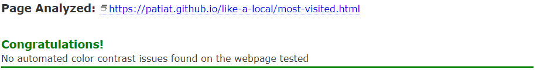
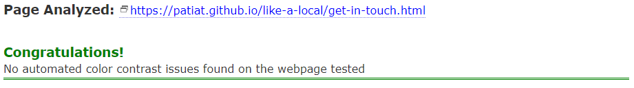

# Testing

The website for Like a Local has been tested using the following methods:
- [Code Validation](#code-validation)
    - [W3C HTML Validator](#w3c-html-validator)
        - [Home Page](#home-page)
        - [Property Details](#property-details-page)
        - [Location Page](#location-page)
        - [Activities Page](#activities-page)
        - [About Page](#about-page)
        - [Contact Page](#contact-page)
    - [W3C CSS Validator](#w3c-css-validator)
    - [JSHINT Javascript Code Quality Tool](#jshint-javascript-code-quality-tool)

- [Chrome Dev Tools - Lighthouse](#chrome-dev-tools---lighthouse)

- [A11y Color Contrast Accessibility Checker](#a11y-color-contrast-accessibility-checker)

- [Browser Compatibility](#browser-compatibility)

- [Responsiveness](#responsiveness)

- [Testing User Stories](#testing-user-stories)
    - [Prospective Tenants](#prospective-tenants)
    - [Returning Tenants](#returning-tenants)
    - [Business Owners](#business-owners)

- [Peer Review](#peer-review)
    - [Slack](#slack)
    - [Google Forms](#google-forms)

- [Mentor](#mentor)
    - [Assistance](#assistance)

- [Bugs](#bugs)
    - [Resolved](#resolved)
    - [Unresolved](#unresolved)
    - [Opportunities for future performance enhancement](#opportunities-for-future-performance-enhancement)

# Code Validation

## W3C HTML Validator

Each page of the Like a Local website was subjected to the [W3C HTML](https://validator.w3.org/) Validator tool, the results are evidenced below:

### Home Page
<h2 align="left"></h2> 

### Must Visit Page
<h2 align="left"></h2> 

### London Quiz Page
<h2 align="left"></h2>  

### Most Visited Page
<h2 align="left"></h2>  

### About Page
<h2 align="left"></h2> 

### Get In Touch Page
<h2 align="left"></h2> 

## W3C CSS Validator

The Like a Local website stylesheet was subjected to the [W3C CSS](https://jigsaw.w3.org/css-validator/) Validator tool, the results are evidenced below:

### style.css (my css)
<h2 align="left"></h2> 

### must-visit-style.css (google css)
<h2 align="left"></h2> 

## JSHINT Javascript Code Quality Tool

The Like a Local website scripts was subjected to the [JSHint](https://jshint.com/) Javascript validation tool, the results are evidenced below:

### script.js (my script)
<h2 align="left"></h2> 

### must-visit.js (google script)
<h2 align="left"></h2> 

### most-visited.js (my script)
<h2 align="left"></h2> 

### sendEmail.js (my script)
<h2 align="left"></h2> 

# Chrome Dev Tools - Lighthouse

The chrome developer tool 'lighthouse' was used to assess the website for Like a Local against the following parameters:
- Performance
- Accessibility
- Best Practices
- SEO (Search Engine Optimisation)

Each page was assessed in terms of desktop performance and mobile performance. Each page performed well and the results are evidenced below:

### Lighthouse report - Home Page
#### Desktop
<h2 align="left"></h2> 

#### Mobile
<h2 align="left"></h2>  

- Suggestions were:
   - Eliminate render-blocking resources

### Lighthouse report - Must Visit Page
#### Desktop
<h2 align="left"></h2> 

#### Mobile
<h2 align="left"></h2>  

- Suggestions were:
   - Eliminate render-blocking resources
   - Reduce unused JavaScript

### Lighthouse report - London Quiz Page
#### Desktop
<h2 align="left"></h2>

#### Mobile
<h2 align="left"></h2> 

- Suggestions were:
   - Eliminate render-blocking resources

### Lighthouse report - Most Visited Page
#### Desktop
<h2 align="left"></h2> 

#### Mobile
<h2 align="left"></h2>  

- Suggestions were:
   - Serve images in next-gen formats

### Lighthouse report - About Page
#### Desktop
<h2 align="left"></h2>  

#### Mobile
<h2 align="left"></h2> 

### Lighthouse report - Get in Touch Page
#### Desktop
<h2 align="left"></h2> 

#### Mobile
<h2 align="left"></h2> 

The lighthouse reports made a number of recommendations which included:
- Serving images in next-gen formats such as WebP and AVIF to provide better compression. I decided to pursue this and this increased performance significantly.
- Some images of provided via the Google API's are not served in next-gen formats.

# A11y Color Contrast Accessibility Checker

All website pages were tested using the A11y Color Contrast Accessibility Checker, the results are evidenced below:

### Home Page
<h2 align="left"></h2>

### Home Page (updated)
<h2 align="left"></h2>

### Must Visit Page
<h2 align="left"></h2> 

### London Quiz Page
<h2 align="left"></h2> 

### London Quiz Page (updated)
<h2 align="left"></h2> 

### Most Visited Page
<h2 align="left"></h2> 

### About Page
<h2 align="left"></h2> 

### About Page (updated)
<h2 align="left"></h2> 

### Get in Touch Page
<h2 align="left"></h2> 

# Browser Compatibility

On desktop, the site was tested in the following browsers:
- Chrome
- Edge
- Firefox
- Safari

No issues were identified with appearance, responsiveness or functionality during usage of the website on these browsers.

On mobile and tablet, the site was tested in the following browsers:
- Chrome
- Safari *see unresolved bugs
- Firefox

No issues were identified with appearance, responsiveness or functionality during usage of the website on these browsers.

# Responsiveness

Responsiveness assessments were undertaken using the Chrome Developer Tools across a number of screen sizes including: 
- iPhone SE
- iPhone XR
- iPhone 12 Pro
- Pixel 5
- Samsung Galaxy S8+
- Samsung Galaxy S20 Ultra
- iPad Mini
- iPad Air
- Surface Pro 7
- Surface Duo
- Galaxy Fold
- Samsung Galaxy A51/71
- Nest Hub
- Nest Hub Max

No issues were identified with appearance, responsiveness or functionality during usage of the website on these virtual screen sizes.

The website was also testing on actual hardware including:
- iPhone 13 Pro
<h2 align="left"></h2>   
- MacBook Air 2015
<h2 align="left"></h2> 
- HP All in One Desktop 27
<h2 align="left"></h2>  
- iPad 2021
<h2 align="left"></h2> 

# Testing User Stories  

### New visitors to London 

* As a new visitor to the website and tourist to London, I would like to learn some basic information about London. 

  - The website contains various information about London which can be accessed through the maps and also the quiz.

* As a new visitor to the website and tourist to London, I would like to test my existing knowledge on all things London by taking a fun and interactive quiz game with London themed questions.

  - The quiz page allows users to test their knowledge about London by playing a game which randomly generates 10 questions from a bank of 40 for each turn of the quiz.

* As a new visitor to the website and tourist to London, I would like to be able to search for things to do using a map of the area of London.

  - The must visit page allows users to use Google's Places API to search for attractions and destinations in the local area by using the search tool and map.

* As a new visitor to the website and tourist to London, I would like to learn where previous customers have visited to decide if I would like to follow suit.

  - The most visited page allows users to view location markers on a map which demonstrate where previous users have visited.

* As a new visitor to the website and tourist to London, I would like to be able to contact the travel guides if I have any questions or special requests.

  - The get in touch page allows users to be able to contact the business owners to request dates for a tour and to make special requests. The users can also communicate their level of knowledge by using the form.

### Returning Visitors  

* As a returning visitor to the website and tourist to London, I would like to know if any new features have been added to the website or if any are planned.

  - Due to the website being of a simple layout and design, new features will be immediately noticeable to returning users.

* As a returning visitor to the website and tourist to London, I would like to know if the frequently visited page has been updated to include recent users.

  - This is not a feature that is currently included in the website design but will be placed in the potential future features section in the README.md file.

* As a returning visitor to the website and tourist to London, I would like to be able to let the website owners know that I am a returning customer when contacting them.

  - This is not a current feature of the website but will be placed in the potential future features section in the README.md file.

### Business Owners   

* As the business owner, I would like my website to be user friendly across all devices and accessible to visually impaired users.  

  - This has been acheived and is demonstrated via the testing of the website on many devices either digitally via the google chrome dev tools or via viewing the website on different hardware.

* As the business owner, I would like the website to effectively promote London as a tourism destination and what the business can offer to facilitate better visits for tourists.

  - This has been acheived by allowing users to choose from multiple options when learning about London, whether through the Google Maps API's or the quiz.
   
* As the business owner, I would like the website to emphasise the openness of us as owners and promote the asking of questions from users via the contact form and social media platforms.  

  - This has been acheived by creating a form which works and submits an email to the business owners with accurate and relevant information given by the user.

# Peer Review

## Slack

- In the last stages of development and testing, I submitted my project for review to fellow students at Code Institute. This was facilitated via the peer code review on Slack. The time between requesting the peer review and the project submission was tight and therefore responses would always be limited. However, one peer reviewed the website and had the following feedback:

  - "When I completed the quiz I couldn't see how to close the pop up window with the score without having to click on play again. Might be good to have an "x" to close it down". 
  - This is a good point that was not necessarily considered during development. I have decided not to make the change at this late stage but will instead add it to the opportunities for future performance enhancement section.
  
# Mentor

## Assistance

- I made site live on GitHub pages early on in the development process to test on real hardware iPhone 13 PRO, Mac Book Air 2015 and HP Desktop 27in.
- Following a pre-project submission meeting for Milestone Project 1 with my Tutor regarding the site layout on large screens and potentially reconfiguring the code to include a margin on the left and right to improve flow and appearance on very large screens. This was adopted for Milestone Project 2.

# Bugs

## Resolved
- The testing of the main JavaScript files was undertaken manually by performing the actions as the user and making amendments where necessary. This process was implemented throughout the entirety of the development of the project and worked well but a more regimented and rigorous testing regime would likely be required for larger and more complex projects.
- During the testing of the website using Google Lighthouse, the performance on mobile was effected negatively by serving the images in PNG format. Therefore, I decided to convert the images to WebP format which significantly improved mobile performance. 
- During the Color Contrast Accessibility Validator testing, I made amendments to the styles of certain buttons and elements on the page to make them more accessible.

## Unresolved
- When viewing the home page on an iPad in portrait orientation and using safari, the images within the cards on the home page stretch. This appears to be a known bug with the safari browser. I therefore need to find a solution to prevent the stretching. 

## Opportunities for future performance enhancement
- Chrome Lighthouse suggestions including:
    - Eliminate render-blocking resources (Resources are blocking the first paint of your page. Consider delivering critical JS/CSS inline and deferring all non-critical JS/styles).
    - Serve static assets with an efficient cache policy (A long cache lifetime can speed up repeat visits to your page).
- Quiz page
    - When a user completes the quiz, there is only a button that states "Play Again" and no button to "Close" if the user wishes to move elsewhere on the website. I beleive this would enhance user experience.

[Back to README.md](https://github.com/PATIAT/like-a-local/blob/main/README.md)